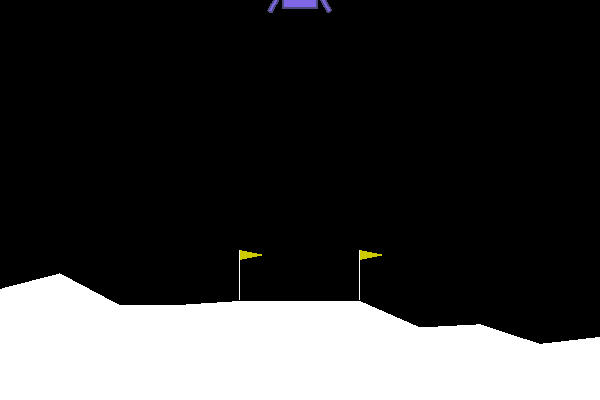

# RL Algorithms using PyTorch on OpenAI Gym

Implementations of several deep reinforcement learning (RL) algorithms using PyTorch

<table>
    <tr>
        <td align="center"></td>
        <td align="center"></td>
    </tr>
</table>

## Implementations

<table>
<thead>
    <tr>
        <th align="left">Algorithm</th>
        <th align="left">Features</th>
        <th align="left">Solved*</th>
        <th align="left">Paper</th>
    </tr>
</thead>
<tbody>
    <tr>
        <td><ul><li> [x] <a href="https://github.com/saswat0/peely/blob/master/Support%20Files/reinforce.py">REINFORCE (Monte-Carlo Policy Gradient)</a></li></ul></td>
        <td><ul><li> [x] Baseline <li> [ ] Causality </ul></td>
        <td><ul><li> [x] CartPole-v0 <li> [x] LunarLander-v2 </ul></td>
        <td><a href="https://link.springer.com/content/pdf/10.1007/BF00992696.pdf">Williams 1992</a></td>
    </tr>
    <tr>
        <td><ul><li> [x] <a href="https://github.com/saswat0/peely/blob/master/Support%20Files/dqn.py">Deep Q-Networks (DQN) </a> </ul> </td>
        <td><ul><li> [x] Huber Loss <li> [x] Gradient Clipping  <li> [x] Polyak Averaging </ul></td>
        <td><ul><li> [x] CartPole-v0 <li> [x] LunarLander-v2 </ul></td>
        <td><a href="https://arxiv.org/abs/1312.5602">Minh et al. 2013</a></td>
    </tr>
    <tr>
        <td><ul><li> [x] <a href="https://github.com/saswat0/peely/blob/master/Support%20Files/dqn.py">Double DQN</a> </ul> </td>
        <td><ul><li> [x] Same as above </ul></td>
        <td><ul><li> [x] CartPole-v0 <li> [x] LunarLander-v2 </ul></td>
        <td><a href="https://arxiv.org/abs/1509.06461">van Hasselt et al. 2015</a></td>
    </tr>
    <tr>
        <td><ul><li> [x] <a href="https://github.com/saswat0/peely/blob/master/Support%20Files/dqn.py">Prioritized Experience Replay</a></ul></td>
        <td><ul><li> [x] Same as above <li> [x] Proportional Prioritization </ul></td>
        <td><ul><li> [x] CartPole-v0 <li> [x] LunarLander-v2 </ul></td>
        <td><a href="https://arxiv.org/abs/1511.05952">Schaul et al. 2016</a></td>
    </tr>
    <tr>
        <td><ul><li> [ ] Dueling DQN </ul></td>
        <td></td>
        <td></td>
        <td><a href="https://arxiv.org/abs/1511.06581">Wang et al. 2016</a></td>
    </tr>
    <tr>
        <td><ul><li> [ ] A2C </ul></td>
        <td></td>
        <td></td>
        <td><a href="https://arxiv.org/abs/1602.01783">Minh el al. 2016</a></td>
    </tr>
    <tr>
        <td><ul><li> [ ] Rainbow </ul></td>
        <td></td>
        <td></td>
        <td><a href="https://arxiv.org/abs/1710.02298">Hessel et al. 2017</a></td>
    </tr>
</tbody>
<tfoot>
    <tr>
        <td colspan="4"> *These are the environments I attempted to solve using my code so far. The algorithms are certainly capable of solving more (check the attached papers for details). I will be trying them on more diverse environments in the future to evaluate my implementation. </td>
    </tr>
</tfoot>
</table>

## Configurations

Each implementation has its own `yaml` config file to easily change model and environment parameters. 
